# Pokemon Essentials 69 张地图扫描与生成规则

> 扫描日期：2026-07-13。来源：Pokemon Essentials v21.1。69/69 个 `MapXXX.rxdata` 均成功解析和渲染。

## 关键结论

- 当前草地灯塔构图不成立：灯塔素材虽然完整，但小池塘不足以建立海岸语义。灯塔应位于连续海域中的近岸基座、礁石平台、岛屿或防波堤上。
- `Outside.png` 确实包含 `3941～3983` 的 3x6 白色灯塔模块，但 69 张示例地图中实际使用灯塔的地图数量为 **0**。因此灯塔位置必须从 Route 4、Route 6、Route 8、港口和岛屿的海岸规则推导。
- Essentials 的地图不是按装饰块随机铺设，而是先确定边界、入口/出口、主路线和功能节点，再用草丛、水域、森林、建筑及前景层填充剩余空间。
- 多出口地图保留所有有效路线；路线应共享入口侧主干，并保证每段道路通向出口、建筑门口或明确事件点。

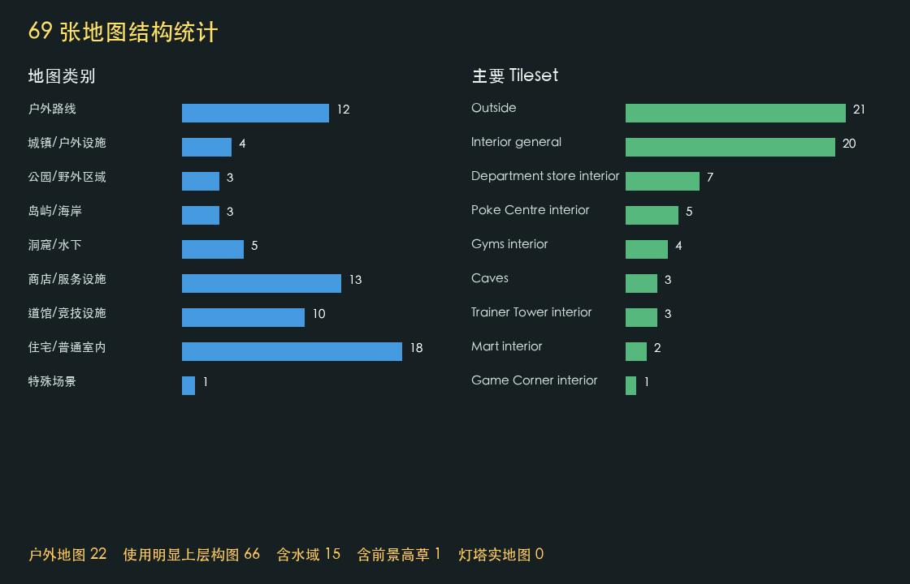

## 全量统计

- 地图总数：69
- 户外路线：12；城镇/户外设施：4；公园/野外区域：3；岛屿/海岸：3
- 洞窟/水下：5；普通室内：18；商店/服务设施：13；道馆/竞技设施：10
- 含水域：15；含森林边界：19；含 Layer 1 前景高草：1
- Tileset 使用量：Outside 21；Interior general 20；Department store interior 7；Poke Centre interior 5；Gyms interior 4；Caves 3；Trainer Tower interior 3；Mart interior 2；Game Corner interior 1；Dungeon cave 1；Underwater 1；Harbour interior 1

## 通用生成规则

### 1. 先画拓扑，再画景观

先确定入口、1～2 个出口、建筑门口、楼梯和事件点，再生成连接这些节点的主路线。剩余区域才分配草丛、水域、森林和装饰。不得先铺大面积道路，再反向寻找可走路线。

### 2. 边界必须有语义

户外地图通常用森林、悬崖、海洋、围栏或建筑连续封边，只在实际转场位置留下窄开口。屏幕边缘不能出现被截断的独立树顶、树根或半个建筑。

### 3. 多出口道路共享主干

多个出口可以同时存在，但路线应先共享入口侧主干，再在靠近出口处形成最短分支。每段道路必须通往入口、出口、门口或事件点；没有用途的道路属于浪费。道路宽度由玩法决定，StickMon 保持两格宽并允许精灵沿两格中线自由移动。

### 4. 地形必须形成连续区域

道路、草丛、水面和山壁使用完整边缘、转角、内部与收口组合。禁止把内部 tile 直接贴到普通草地，也不能用池塘模块冒充海洋。小水面使用池塘边缘；海岸使用 Sea deep -> Sea edge -> shore -> land 的连续过渡。

### 5. 草有两种高度语义

`390` 是 Layer 0 的普通可遇敌草；`391` 是 Map028 使用的 Layer 1 前景高草，具有 `priority=1` 和 `terrainTag=10`。高草应成片分布在道路两侧，不能盖住出口、道路、水面、灯塔或建筑门口。

### 6. 森林是多行模板

Map039 的森林由 Layer 2 树冠、Layer 1 栅栏、Layer 0 接缝行、树顶/树身对和根部组成。根部上一行必须是树身；位于地图底部时仍要保持完整序列，不能把树顶直接接根部。`800/801 -> 808/809 -> 818/819` 只是缺少树冠的森林片段，不是完整独立树；它只能作为从画面上方继续进入地图的连续边界，且顶行必须严格位于 `y=0`。地图内部、底部及左右边缘均禁止使用该片段。

### 7. 地标需要环境支撑

地标不应孤立摆放。建筑门口需要前庭和道路；喷泉需要广场；灯塔需要连续水域、海岸或堤岸；桥梁两端需要可达道路。地标周围应留出可识别轮廓和交互空间。

### 8. 建筑门口对齐道路

城镇建筑通常沿道路或广场布置，门口前至少留出 1～2 格净空。屋顶、招牌和树冠可进入上层，但碰撞仍由底层结构和 passage 决定。

### 9. 室内保持中央通道

住宅、商店和设施多采用矩形房间：墙体封边，家具沿墙或围绕功能区布置，入口到柜台、楼梯或事件点的中央通道保持畅通。竞技场和多层商店则使用明显的轴线与对称布局。

### 10. 洞窟按高度带组织

洞窟用连续岩壁带、台阶和窄口表达高度变化。岩石用于修整轮廓和控制通路宽度，不能随机散落到主路中央。楼梯必须连接两个可读的高度区域；楼梯所在的连续崖带必须保持同一高度，不得直接邻接另一段异高悬崖。

### 11. 三层图块语义不能互换

Layer 0 放地面和主体；Layer 1 放高草、围栏、建筑与可遮挡结构；Layer 2 放树冠、屋檐和更高前景。`passages`、`priorities`、`terrainTags` 必须随原 tile 保留。

### 12. StickMon 的裁图规则

先在更大的逻辑地图上生成完整拓扑，再选择 16x12 格镜头区域。镜头内必须同时看见当前位置、至少一段前进方向和一个景观锚点；不要为了塞满屏幕而截断树、建筑或海岸过渡。

## 代表性地图

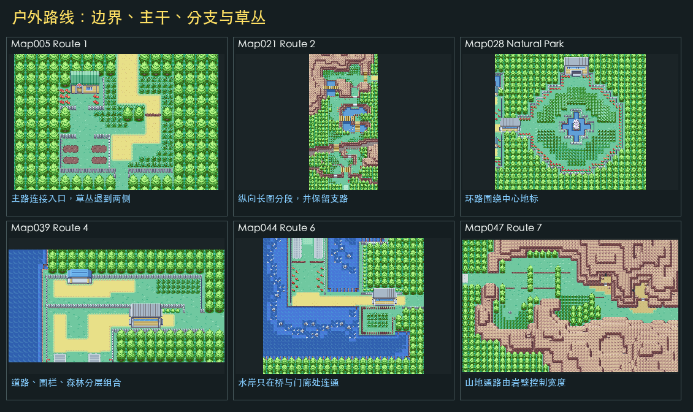

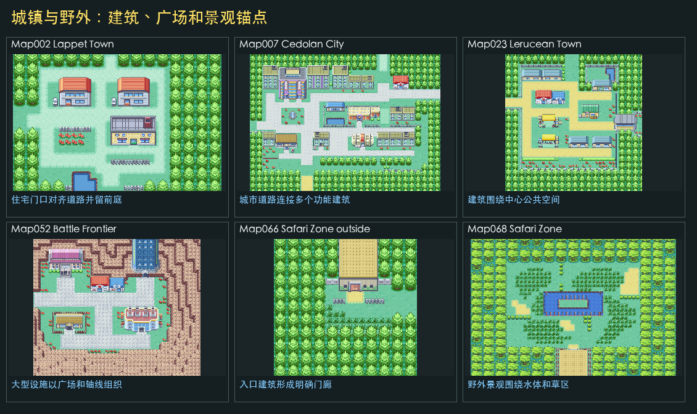

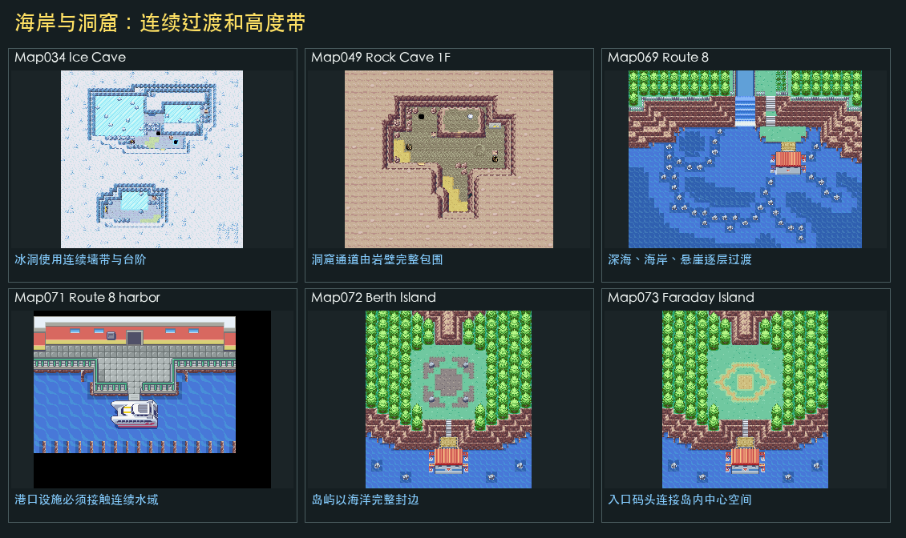

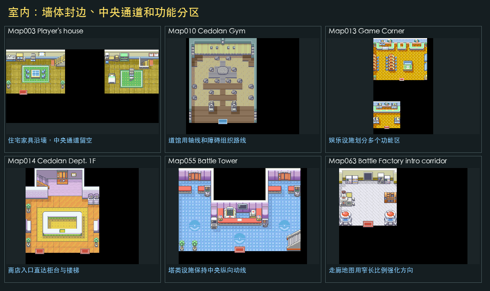

## 应用到 StickMon：溪流、桥梁与坡壁

### 溪流主体

- 竖向溪流使用 `Outside.png` 的左岸 `1096`、水面 `1097` 和右岸 `1098`，最小宽度为 3 格。
- 溪流可以保持直线，也可分段变宽或变窄；禁止在宽度不变时只横向平移整条水道。
- 每个分段边界上，单侧河岸最多移动 1 格。更大的宽度变化必须拆成多个渐进分段。

### 岸角拼接

- 溪流变宽或变窄时不能用草地直接截断竖直岸线，每一侧必须使用“外角 + 内角”两个 tile 连续收口。
- 向屏幕下方变宽使用 Essentials 原生上岸角：外角 `1088/1090`，内角 `1104/1106`。
- 向屏幕下方收窄使用上述岸角的纵向翻转派生 tile `4400～4403`，保留相同泥土质感，并继承原 tile 的 `passages`、`priorities` 和 `terrainTags=6`。

### 桥梁、石块与语义

- 桥面覆盖行及其上下各 2 格是直流缓冲区：溪流的左岸位置和宽度必须保持不变，转折、变宽和变窄都不能发生在桥下或桥边。
- 横桥只承载水平方向直行。桥端必须至少落到 1 格完整陆地平台，分叉、直角转向和上下楼梯均应从桥外的陆地格开始；不得把桥面延伸到转向格，否则桥 tile 的方向 passage 会产生视觉可走但语义阻挡的无效路线边。
- 水中石块必须完全位于水面中，不得覆盖桥梁或路线。所有溪岸转角格及其周围 1 格均为石块禁放区，避免高层石块帧遮挡泥土岸角。
- 桥面是陆地通行面；普通溪水保持水面和漂浮通行语义；水中石块同时阻挡陆地与漂浮移动。

### 坡壁与楼梯

- 横向坡壁使用 `Outside.png` 的崖顶 `1188`、崖面 `1185`，两格宽楼梯使用 `1161/1162`；崖顶写入 Layer 0，崖面写入 Layer 1，楼梯覆盖两层坡壁并作为唯一陆行穿越点。
- 楼梯左右至少各保留 1 格同高度悬崖，且楼梯所在的整个连续崖带必须保持同一高度。不同高度的悬崖段不得直接连在该崖带左右；需要错层时，应将其设计为独立地形模块。
- 生成悬崖前必须验证楼梯上下均与两格宽道路连续；悬崖本体不得覆盖路线、溪流或桥梁，路线与崖带的交集只能是楼梯四格。
- 岩石可用于遮蔽远离楼梯的错层接缝，但不得盖住楼梯、路线或溪岸转角。

### 运行时生成顺序

- 运行时算法 v4 将区域编号 `1` 映射为“溪桥坡地”。先生成入口、真实分叉点和两个出口的两格宽路网，再枚举一条只在同一桥区与道路相交的竖向溪流；16 次确定性拓扑尝试仍无合法桥位时才判定生成失败。
- 地形按“普通地面 -> 溪流与岸角 -> 悬崖与楼梯 -> 桥梁与水中石块 -> 道路 -> 草丛/鲜花/灌木”合成。道路不得覆盖水面或崖面，路径落入水面时必须位于桥面，路径落入崖带时必须位于楼梯。
- 拓扑、地表和溪流特征使用独立 XorShift32 随机流；C++ 与 Python 必须共享候选枚举顺序、随机数调用顺序、算法版本和 FNV 指纹。同一 `seed + entryEdge + areaIndex` 必须生成完全相同的三层 tile 数据。

## 应用到 StickMon：古木瀑谷的动画水面与瀑布

### Map069 autotile 槽位

- 参考地图固定为 Map069 Route 8，`autotileNames` 顺序必须是 `Sea`、`Sea without shore`、`Sea deep`、`Sand shore`、`Waterfall crest`、`Waterfall`、`Waterfall bottom`。改变顺序会让相同 tile ID 映射到错误资源。
- `Sea.png`、`Sea without shore.png`、`Sea deep.png` 和 `Sand shore.png` 均为 `768x128`，即 8 个 `96x128` 的 RPG Maker XP autotile 动画帧。
- `Waterfall crest.png`、`Waterfall.png` 和 `Waterfall bottom.png` 均为 `128x32`，即 4 个 `32x32` 动画帧。

### Sea 水面与岸线

- 古木瀑谷上下游统一使用 `Sea` 槽位 `48～95`，保留 `terrainTag=7` 和漂浮水面语义；禁止再使用无动画的 `1096/1097/1098` 静态溪流块。
- 直流水道使用中心水面 `48`、左岸 `64`、右岸 `72`。水道从地图顶部进入时保持左右岸连续，不在 `y=0` 增加横向封口。
- 瀑底扩宽水潭的第一行必须声明 `top_open_spans`：瀑布正下方继续使用水面 `48`；水潭最左侧使用左上岸角 `84`，最右侧使用右上岸角 `80`；两个落水口之间没有瀑布覆盖的格使用连续上岸 `68`。第二行起恢复 `64 -> 48 -> 72` 的左右岸结构。
- `84/80` 的外侧角包含透明像素，不能直接放在没有底图的 Layer 0，否则透明区会露出黑色画布。生成器必须先在 Layer 0 放普通草地 `385`，再把这两个岸角放入 Layer 1；水域碰撞与 `terrainTag=7` 仍由上层 Sea 岸角提供。
- 圆角处出现的黑点不是新的岸线 tile，而是 `84/80` 的透明像素读到了值为 `0` 的空图层。修复时禁止涂改或裁切原 Sea 帧；C++、Python 和预生成地图都必须保持“同一格 Layer 0=`385`、Layer 1=`84/80`”的双层结构。回归测试必须枚举 Layer 1 的每个 `84/80`，确认同索引 Layer 0 为 `385`，并检查瀑底两个外角均存在。
- `Sea without shore` 槽位 `96～143` 同样有 8 帧波动，但不提供与陆地接触所需的泥岸轮廓，只能用于完全被其他岸线包围的水面内部，不能直接贴草地或悬崖。

### 瀑布拼接与语义

- 瀑布顶使用 `240～287`，当前横向模板为左 `283`、中 `273`、右 `285`；瀑布主体使用 `288～335`，按顶部 `322/308/324`、中段 `304/288/312`、下段 `328/316/326` 排列；瀑布底使用 `336～383`，当前整行使用 `336`。
- 瀑布宽度至少 3 格，结构顺序固定为“上游 Sea 水面 -> 1 行瀑布顶 -> 至少 2 行瀑身 -> 1 行瀑布底 -> 下游 Sea 水面”。瀑布缺口不得被悬崖回填，水中石块不得覆盖瀑布或落水口岸角。
- 瀑布顶保持 `terrainTag=9`，瀑身和瀑底保持 `terrainTag=8`。它们属于水域但普通漂浮不能通过；下游 `Sea` 水面保持可漂浮。

### 动画导出

- Python 预览按 8 帧全局循环：Sea 使用第 `i` 帧，瀑布三段使用第 `i % 4` 帧，当前每帧 `140 ms`。PNG 只保存首帧，GIF 用于检查岸线和水流动画连续性。
- C++ 运行时同步时必须保留相同帧索引规则，不能把 8 帧资源提前压成单张静态 tile。

### 截图参考的瀑海群岛

- “瀑海群岛”采用水面优先拓扑：Layer 0 先铺满 8 帧 Sea 中心水面 `48`，再叠加屏顶大瀑布、岩岛和桥。瀑布有三类方向模板：`left=0` 的左入瀑、`left+width=16` 的右入瀑，以及 `left=0,width=16` 的全宽瀑布；瀑身高度允许 2、3、4 格。左入瀑从右侧可见崖边到地图右边界整块填充不可通行洞穴悬崖，右入瀑镜像处理；该矩形内包括紧贴瀑布的一列、屏幕最外列和最底行在内，每格都必须是悬崖块，并按左缘 `576`、中部 `577`、右缘 `578` 组成一个连续崖面，不得机械重复边缘，也不得混入岸侧块 `512/514` 或底缘收口块 `520/521/522`。全宽瀑布不生成侧壁或悬崖填充。禁止以可站立岛面代替悬崖，也禁止在开放水面中只留一列孤立岩壁。画面内不放瀑布顶、上游水池或封闭落水潭，瀑布底与最近下游岩岛之间至少保留两整行 Sea，不能用岩岛承接瀑布。
- 瀑布下方以及岩岛周围的全部 Sea 必须形成一个四向连通水域。生成器需要对全部 `water_cells` 做洪泛检查，禁止瀑布侧壁、触边岛屿或长岩墙把水面切成互不连通的水池。水面仍保留 `terrainTag=7`、8 帧波动和未来漂浮通行语义。
- 岩岛使用 Map049/Caves 的抬高平台结构：顶边 `504/505/506`，左右侧壁 `512/514`，底边 `520/521/522`，内部统一显示浅色岛面 `513`。路线只保留在 `road_cells` 语义中，不得再用 `610` 绘制可见道路。因原始 `513` 的 passage 为全向阻挡，Python 预览 ID `4603` 取 `Caves:513` 的像素、复制 `Caves:610` 的 passage/priority/terrainTag，兼顾统一岛面和路线通行。每张图至少放置两个彼此分离的岩岛；岛缘绘制在 Layer 1，Layer 0 必须保留 Sea `48` 作为透明像素衬底，使四个圆角露出水面，不得铺 `513` 或其他地面。本场景禁止使用 Sea 岸角 `84/80`，也不生成封闭 `cave_basins`。
- 入口与每个出口都通过岩岛自身延伸出屏实现，禁止附加门框。`extend_left/right/top/bottom_to_edge` 只能在岛体确实接触对应地图边界时启用；启用后取消该方向的侧壁，边界上的内部格继续使用浅色可通行岛面。与延伸方向垂直的岛缘仍保留到屏幕边界，并使用中段 `505/521` 或 `512/514`，不绘制表示岛体终止的角块。所有位于屏幕边界的路线格必须同时属于 `land_cells`，不得落入 Sea 或 cliff。
- 单侧瀑布旁的悬崖填充整体属于 `cliff_cells`，不得生成 `land_cells`、装饰岩柱或可站立高台。`576/577/578` 本身形成连续悬垂岩纹，不再额外叠加 `557～567` 地面岩柱模块。
- Caves 块的人工确认用途统一记录在 `doc/essentials_map_analysis/Caves地形块语义.md`。边界出入口可用岛面直接延伸、山洞口、岩石台阶或梯子表达；同一组候选图中只在 1～2 张使用梯子，保留其他出入口作为视觉对照。
- `541` 下行梯口仍叠加在 Layer 0 的中心 `610` 上，但 3x3 模块顶部必须按环境选型：顶部紧接小岛或岩石块边缘时使用 `601/602/603`；其余情况使用 `617/618/619` 的 Y 轴镜像。中排保持 `609/610/611`，底排保持 `617/618/619`。九格必须全部属于 `land_cells` 且不与水面、悬崖或桥相交，中心必须属于 `road_cells`，模块轮廓必须接触声明的边界出入口；禁止单独生成 `541`。现有 `4610/4611/4612` 和候选地图仍是旧的固定顶排方案，本次只登记新语义，待视觉确认后再添加镜像别名、更新生成器并重新导图。
- 岛间桥使用 Outside 的横桥 `1627/1635/1643`，在 Caves 预览中映射为混合来源 ID `4600/4601/4602`。桥必须跨过至少一个真实水格，两端落到不同岩岛，并覆盖岛缘至岛面；路线与水面或岛缘的交集只能是桥格。桥只承载水平直行，分叉、直角转向和上下出口必须退回岛面，否则桥上下边的方向阻挡会产生无效路线边。
- 每张图必须同时导出首帧 PNG、8 帧 GIF、路线图和语义图。四张回归图必须覆盖左入、右入、全宽三类瀑布与 2/3/4 三种瀑身高度。其余回归要求为全部边界路线格属于出屏岩岛面、不得出现预览门框 ID `4604～4607`、全部水格同属一个连通分量、瀑布底下一格仍为水、岛缘底层均为 Sea、单侧瀑布悬崖全部属于 cliff 并填至对应边界、岩岛与瀑布不重叠、至少存在一段 `bridge & route & water`、`invalidRouteEdges=0`。该场景当前仅作为 Python 候选图，在选定前不将 Caves 岩岛、悬崖或混合桥面帧写入运行时地图包。

### 运行时生成顺序

- 运行时算法 v5 将区域编号 `5` 映射为“古木瀑谷”。根据本层入口的上、右、下、左方向选择对应的已验证布局，均保留一个真实分叉点、两个不同边缘出口、两格宽道路、瀑布缺口和同高楼梯；随机地表装饰仍由 map seed 决定。
- 合成顺序固定为“普通草地 -> Sea 上下游 -> 瀑布顶/身/底 -> 瀑布墙与楼梯 -> 水中石块 -> 顶边森林与岩石 -> 道路 -> 连通草区/花簇/灌木”。道路只能穿越楼梯，不得覆盖 Sea、瀑布或顶边森林；水中石块不得覆盖落水口和圆角。
- 固件按 `millis / 140` 得到 8 帧全局索引；Sea 使用完整索引，瀑布使用 `index % 4`。Python 与 C++ 的三层 tile、结构标记和 FNV 指纹必须保持一致。

### 顶部森林片段

- `top_edge_forest_clusters` 仅用于表现从地图上方继续延伸的森林边界，生成器强制其顶行为 `y=0`。当前三行使用 `800/801`、`808/809`、`818/819`，缺失的树冠必须位于视口之外。
- 该片段禁止出现在地图底部、内部，或作为脱离顶部的左右侧边模块。允许从 `y=0` 延伸到左上/右上角，因为截断方向仍然是画面上方；底部和内部需要森林时，必须使用带 Layer 2 `804/805` 树冠、Layer 0 接缝/树身/根部的完整 `stamp_forest_fence` 模板，或使用另行验证过的完整独立树模板；空间不足时改用整块草丛、花簇、灌木或岩石。

## 应用到 StickMon：灯塔海岸修正

修正版不再使用错误的 `392～410` 空地图块。地图左侧按 Map039 的深海、深海边缘、近岸和陆地顺序构造连续海岸，灯塔基座位于近岸水中，道路与草地留在陆地侧。小型封闭水池另用 Map028 的 `1088～1106` 岩岸静水模块；禁止仅修改 passage/terrainTag 把视觉空地伪装成水面。

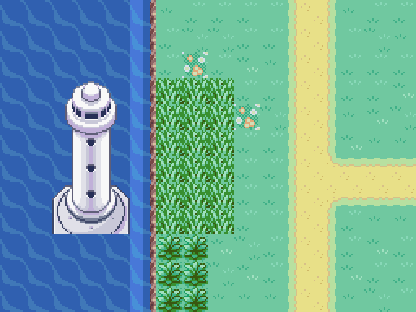

## 图层证据

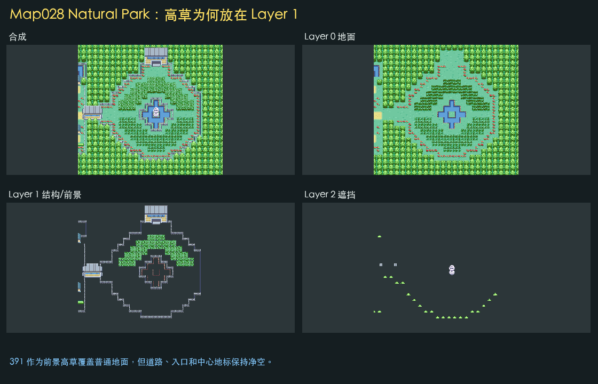

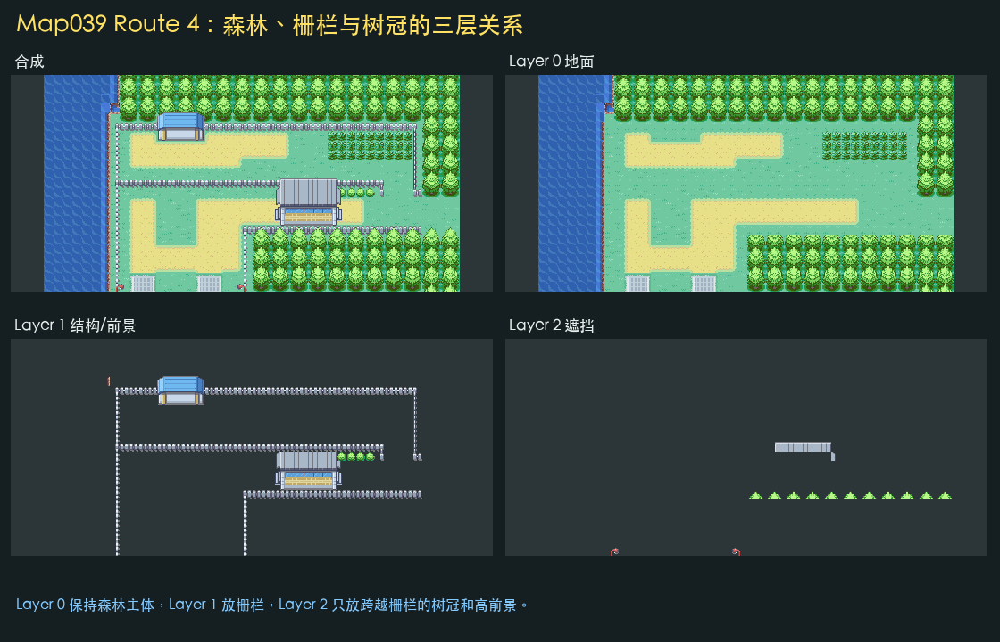

## 全部地图图册

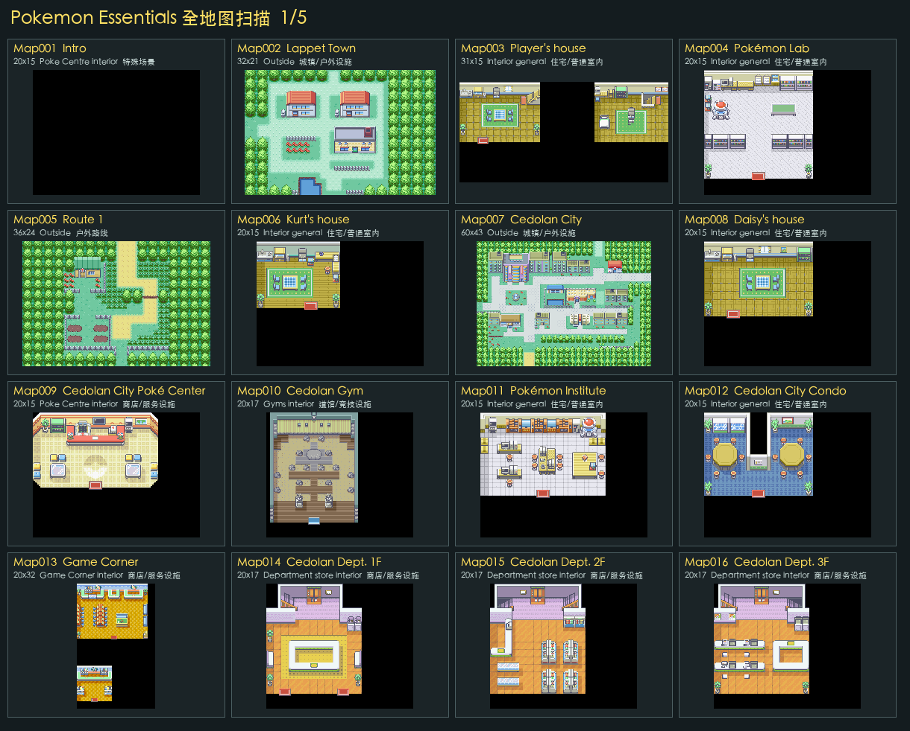

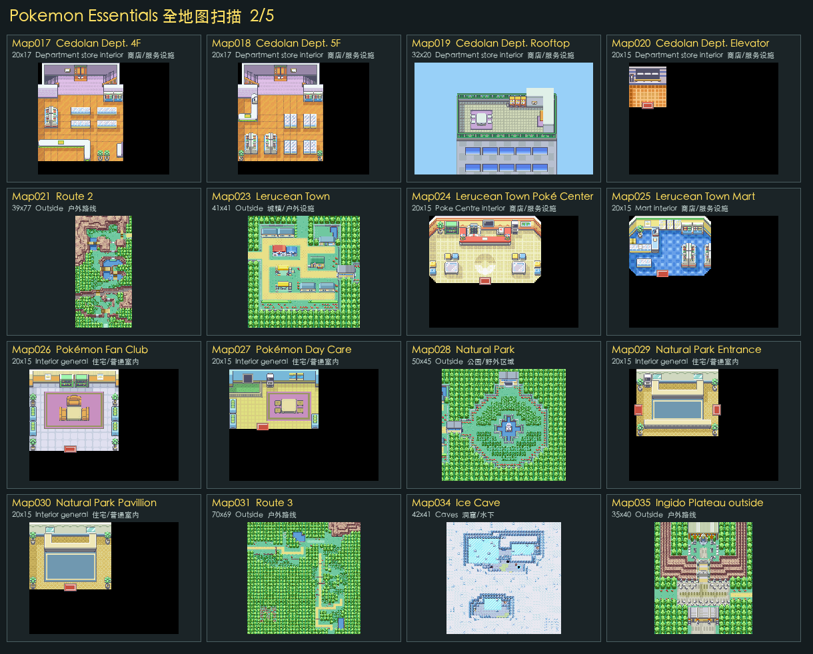

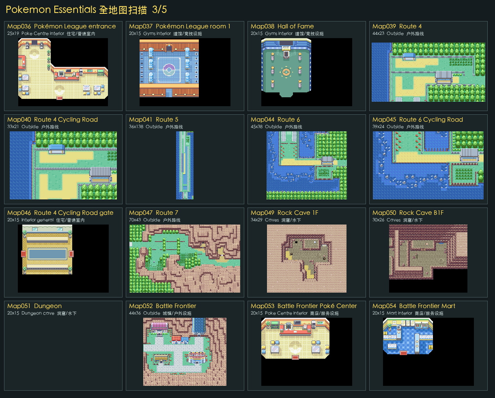

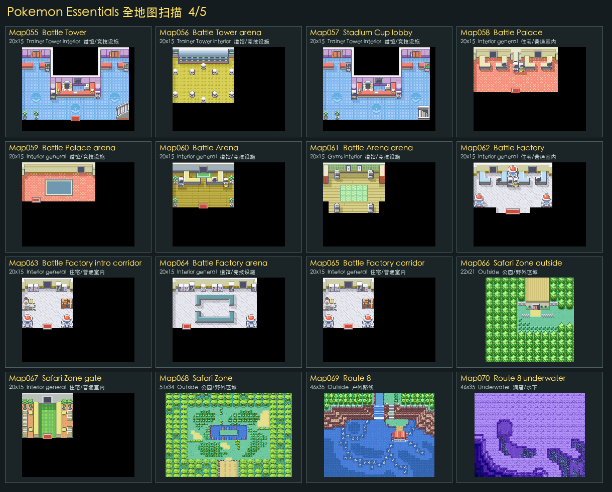

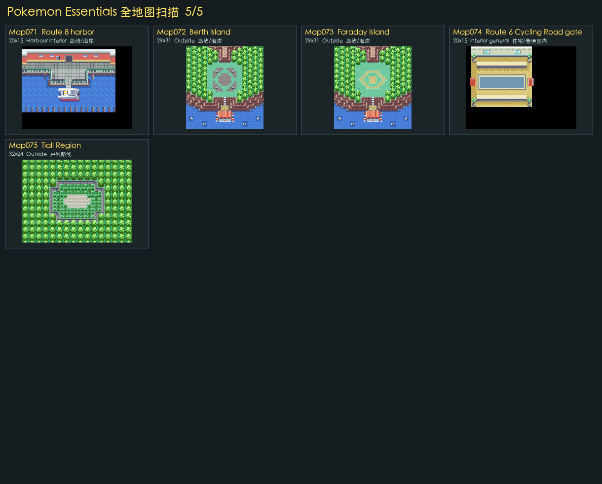

## 逐图索引

| ID | 名称 | 类别 | 尺寸 | Tileset | 事件 | L1/L2覆盖 | 特征 |
|---:|---|---|---:|---|---:|---:|---|
| 001 | Intro | 特殊场景 | 20x15 | Poke Centre interior | 2 | 0%/0% | 基础地形 |
| 002 | Lappet Town | 城镇/户外设施 | 32x21 | Outside | 4 | 17%/2% | 森林边界、栅栏、水域 |
| 003 | Player's house | 住宅/普通室内 | 31x15 | Interior general | 14 | 23%/3% | 室内分区 |
| 004 | Pokémon Lab | 住宅/普通室内 | 20x15 | Interior general | 11 | 28%/1% | 室内分区 |
| 005 | Route 1 | 户外路线 | 36x24 | Outside | 11 | 11%/4% | 道路、草丛、森林边界、栅栏 |
| 006 | Kurt's house | 住宅/普通室内 | 20x15 | Interior general | 2 | 18%/4% | 室内分区 |
| 007 | Cedolan City | 城镇/户外设施 | 60x43 | Outside | 11 | 24%/6% | 道路、森林边界、栅栏、水域 |
| 008 | Daisy's house | 住宅/普通室内 | 20x15 | Interior general | 6 | 20%/3% | 室内分区 |
| 009 | Cedolan City Poké Center | 商店/服务设施 | 20x15 | Poke Centre interior | 6 | 21%/1% | 室内分区 |
| 010 | Cedolan Gym | 道馆/竞技设施 | 20x17 | Gyms interior | 4 | 5%/0% | 室内分区 |
| 011 | Pokémon Institute | 住宅/普通室内 | 20x15 | Interior general | 5 | 31%/6% | 室内分区 |
| 012 | Cedolan City Condo | 住宅/普通室内 | 20x15 | Interior general | 5 | 23%/1% | 室内分区 |
| 013 | Game Corner | 商店/服务设施 | 20x32 | Game Corner interior | 31 | 23%/1% | 室内分区 |
| 014 | Cedolan Dept. 1F | 商店/服务设施 | 20x17 | Department store interior | 6 | 22%/1% | 室内分区 |
| 015 | Cedolan Dept. 2F | 商店/服务设施 | 20x17 | Department store interior | 6 | 21%/3% | 室内分区 |
| 016 | Cedolan Dept. 3F | 商店/服务设施 | 20x17 | Department store interior | 5 | 24%/6% | 室内分区 |
| 017 | Cedolan Dept. 4F | 商店/服务设施 | 20x17 | Department store interior | 5 | 23%/2% | 室内分区 |
| 018 | Cedolan Dept. 5F | 商店/服务设施 | 20x17 | Department store interior | 6 | 21%/3% | 室内分区 |
| 019 | Cedolan Dept. Rooftop | 商店/服务设施 | 32x20 | Department store interior | 3 | 11%/3% | 室内分区 |
| 020 | Cedolan Dept. Elevator | 商店/服务设施 | 20x15 | Department store interior | 5 | 2%/0% | 室内分区 |
| 021 | Route 2 | 户外路线 | 39x77 | Outside | 17 | 14%/11% | 道路、草丛、森林边界、栅栏、水域 |
| 023 | Lerucean Town | 城镇/户外设施 | 41x41 | Outside | 9 | 24%/4% | 道路、森林边界、栅栏 |
| 024 | Lerucean Town Poké Center | 商店/服务设施 | 20x15 | Poke Centre interior | 6 | 21%/1% | 室内分区 |
| 025 | Lerucean Town Mart | 商店/服务设施 | 20x15 | Mart interior | 4 | 20%/1% | 室内分区 |
| 026 | Pokémon Fan Club | 住宅/普通室内 | 20x15 | Interior general | 8 | 17%/0% | 室内分区 |
| 027 | Pokémon Day Care | 住宅/普通室内 | 20x15 | Interior general | 4 | 14%/0% | 室内分区 |
| 028 | Natural Park | 公园/野外区域 | 50x45 | Outside | 3 | 21%/2% | 道路、草丛、前景高草、森林边界、栅栏、水域 |
| 029 | Natural Park Entrance | 住宅/普通室内 | 20x15 | Interior general | 4 | 18%/1% | 室内分区 |
| 030 | Natural Park Pavillion | 住宅/普通室内 | 20x15 | Interior general | 7 | 10%/0% | 室内分区 |
| 031 | Route 3 | 户外路线 | 70x69 | Outside | 30 | 2%/3% | 道路、草丛、森林边界 |
| 034 | Ice Cave | 洞窟/水下 | 42x41 | Caves | 11 | 30%/0% | 岩壁分层 |
| 035 | Ingido Plateau outside | 户外路线 | 35x40 | Outside | 2 | 22%/5% | 道路、森林边界 |
| 036 | Pokémon League entrance | 住宅/普通室内 | 25x19 | Poke Centre interior | 8 | 19%/1% | 室内分区 |
| 037 | Pokémon League room 1 | 道馆/竞技设施 | 20x15 | Gyms interior | 3 | 13%/1% | 室内分区 |
| 038 | Hall of Fame | 道馆/竞技设施 | 20x15 | Gyms interior | 1 | 0%/0% | 室内分区 |
| 039 | Route 4 | 户外路线 | 44x23 | Outside | 1 | 16%/3% | 道路、草丛、森林边界、栅栏、水域 |
| 040 | Route 4 Cycling Road | 户外路线 | 33x21 | Outside | 1 | 18%/3% | 道路、草丛、森林边界、栅栏、水域 |
| 041 | Route 5 | 户外路线 | 36x138 | Outside | 96 | 14%/4% | 道路、草丛、森林边界、栅栏、水域 |
| 044 | Route 6 | 户外路线 | 45x38 | Outside | 1 | 18%/6% | 道路、草丛、森林边界、栅栏、水域 |
| 045 | Route 6 Cycling Road | 户外路线 | 39x24 | Outside | 1 | 22%/1% | 道路、草丛、森林边界、栅栏、水域 |
| 046 | Route 4 Cycling Road gate | 住宅/普通室内 | 20x15 | Interior general | 3 | 28%/0% | 室内分区 |
| 047 | Route 7 | 户外路线 | 70x43 | Outside | 12 | 11%/2% | 草丛、森林边界 |
| 049 | Rock Cave 1F | 洞窟/水下 | 34x29 | Caves | 16 | 20%/1% | 岩壁分层 |
| 050 | Rock Cave B1F | 洞窟/水下 | 30x26 | Caves | 4 | 41%/9% | 岩壁分层 |
| 051 | Dungeon | 洞窟/水下 | 20x15 | Dungeon cave | 1 | 0%/0% | 岩壁分层 |
| 052 | Battle Frontier | 城镇/户外设施 | 44x36 | Outside | 6 | 23%/4% | 基础地形 |
| 053 | Battle Frontier Poké Center | 商店/服务设施 | 20x15 | Poke Centre interior | 6 | 21%/1% | 室内分区 |
| 054 | Battle Frontier Mart | 商店/服务设施 | 20x15 | Mart interior | 6 | 19%/1% | 室内分区 |
| 055 | Battle Tower | 道馆/竞技设施 | 20x15 | Trainer Tower interior | 12 | 22%/5% | 室内分区 |
| 056 | Battle Tower arena | 道馆/竞技设施 | 20x15 | Trainer Tower interior | 2 | 7%/0% | 室内分区 |
| 057 | Stadium Cup lobby | 道馆/竞技设施 | 20x15 | Trainer Tower interior | 11 | 19%/5% | 室内分区 |
| 058 | Battle Palace | 住宅/普通室内 | 20x15 | Interior general | 7 | 16%/2% | 室内分区 |
| 059 | Battle Palace arena | 道馆/竞技设施 | 20x15 | Interior general | 2 | 5%/0% | 室内分区 |
| 060 | Battle Arena | 道馆/竞技设施 | 20x15 | Interior general | 5 | 13%/2% | 室内分区 |
| 061 | Battle Arena arena | 道馆/竞技设施 | 20x15 | Gyms interior | 2 | 3%/0% | 室内分区 |
| 062 | Battle Factory | 住宅/普通室内 | 20x15 | Interior general | 8 | 21%/3% | 室内分区 |
| 063 | Battle Factory intro corridor | 住宅/普通室内 | 20x15 | Interior general | 1 | 16%/0% | 室内分区 |
| 064 | Battle Factory arena | 道馆/竞技设施 | 20x15 | Interior general | 2 | 12%/0% | 室内分区 |
| 065 | Battle Factory corridor | 住宅/普通室内 | 20x15 | Interior general | 1 | 16%/0% | 室内分区 |
| 066 | Safari Zone outside | 公园/野外区域 | 22x21 | Outside | 1 | 13%/3% | 道路、草丛、森林边界、栅栏 |
| 067 | Safari Zone gate | 住宅/普通室内 | 20x15 | Interior general | 2 | 14%/0% | 室内分区 |
| 068 | Safari Zone | 公园/野外区域 | 51x34 | Outside | 3 | 10%/4% | 道路、草丛、水域 |
| 069 | Route 8 | 户外路线 | 46x35 | Outside | 5 | 16%/3% | 草丛、森林边界、栅栏、水域、瀑布 |
| 070 | Route 8 underwater | 洞窟/水下 | 46x35 | Underwater | 0 | 15%/0% | 水域、岩壁分层 |
| 071 | Route 8 harbor | 岛屿/海岸 | 20x15 | Harbour interior | 4 | 42%/5% | 水域 |
| 072 | Berth Island | 岛屿/海岸 | 29x31 | Outside | 8 | 9%/6% | 森林边界、水域 |
| 073 | Faraday Island | 岛屿/海岸 | 29x31 | Outside | 4 | 9%/6% | 森林边界、水域 |
| 074 | Route 6 Cycling Road gate | 住宅/普通室内 | 20x15 | Interior general | 3 | 28%/0% | 室内分区 |
| 075 | Tiall Region | 户外路线 | 32x24 | Outside | 1 | 7%/2% | 草丛、森林边界 |
